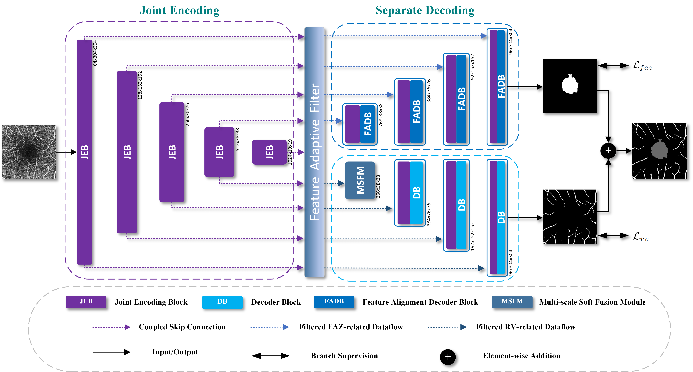

# Joint-Seg: Treat Foveal Avascular Zone and Retinal Vessel Segmentation in OCTA Images as a Joint Task 【[IEEE TIM](https://ieeexplore.ieee.org/document/9837090)】

## Overview


## Citation
If you find this repository helpful, please consider citing:
```
K. Hu, S. Jiang, Y. Zhang, X. Li and X. Gao, "Joint-Seg: Treat Foveal Avascular Zone and Retinal Vessel Segmentation in OCTA Images as a Joint Task," in IEEE Transactions on Instrumentation and Measurement, vol. 71, pp. 1-13, 2022, Art no. 4007113, doi: 10.1109/TIM.2022.3193188.
```
or
```
@ARTICLE{9837090,
  author={Hu, Kai and Jiang, Shuai and Zhang, Yuan and Li, Xuanya and Gao, Xieping},
  journal={IEEE Transactions on Instrumentation and Measurement}, 
  title={Joint-Seg: Treat Foveal Avascular Zone and Retinal Vessel Segmentation in OCTA Images as a Joint Task}, 
  year={2022},
  volume={71},
  number={},
  pages={1-13},
  doi={10.1109/TIM.2022.3193188}
}
```
